# MultiscaleFEM.jl

## Introduction

This repository contains the source code to implement the Localized Orthogonal Decomposition method and the Higher order Multiscale Method to solve the Poisson problem

$$
\begin{align*}
    -(D_{\varepsilon}(x)u'(x))' = f(x) &\quad x \in \Omega = (0,1),\\
    u(0) = u(1) = 0,
\end{align*}
$$

the heat equation supplemented with initial and boundary conditions 

$$
\begin{align*}
  u_t - (D_{\varepsilon}(x)u'(x,t))' = f(x,t) &\quad x \in \Omega \times t = (0,1) \times (0,\infty),\\
  u(x,0) = u_0(x) &\quad x \in \Omega,\\
  u(0,t) = u(1,t) =0 &\quad t \in (0,\infty),
\end{align*}
$$

and the wave equation

$$
\begin{align*}
  u_{tt} - (D_{\varepsilon}(x)u'(x,t))' = f(x,t) &\quad x \in \Omega \times t = (0,1) \times (0,\infty),\\
  u(x,0) = u_0(x) &\quad x \in \Omega,\\
  u_t(x,0) = u_1(x) &\quad x \in \Omega,\\
  u(0,t) = u(1,t) =0 &\quad t \in (0,\infty),
\end{align*}
$$

Here $D_{\varepsilon}$ is a highly oscillatory coefficient. 

## Higher order multiscale method
-------

The higher order multiscale method is similar to the localized orthogonal decomposition method, but can be extended to the higher order setting. The implementation is based on the paper by [Maier, R.](https://epubs.siam.org/doi/abs/10.1137/20M1364321). This method is local upto the patch of size $l$ ouside the element. I then use the standard finite element on the patch to compute the projection of the $L^2$ functions on the coarse space. This mesh on the fine scale needs to sufficiently small to resolve the oscillations. This works since the problem is solved locally and often the oscillations could be captured on a reasonably small mesh. The new basis function then contains the fine scale information and can be used to find the numerical solution that resolves the oscillations on the fine scale. This needs to be computed once and can be used repeatedly, for example, to solve time dependent problems. For example, the following figure shows the multiscale basis function containing the fine scale information. The diffusion coefficient here is a piecewise constant function on a very fine scale $(\epsilon = 2^{-7})$. 

| 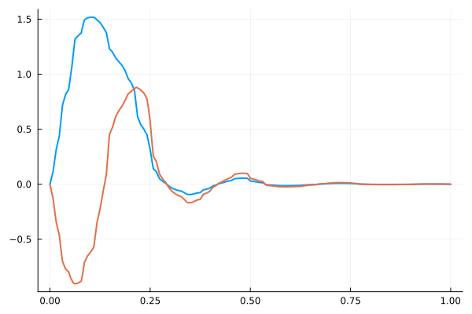 |
| --- |

### Poisson equation in 1D

The script `HigherOrderMS/1d_Poisson_eqn.jl` contains the code to solve the one-dimensional Poisson problem using the Higher Order Multiscale method. I implement three different diffusion coefficients:

$$
D_{\varepsilon}(x) = 0.5, \quad D_{\varepsilon}(x) = \left(2 + \cos{\frac{2\pi x}{2^{-6}}}\right)^{-1}, \quad D_{\varepsilon}(x) = \text{rand}\left(0.5, 5.0;\, \epsilon = 2^{-12} \right).
$$

where $\epsilon = 2^{-12}$ denotes the scale of the randomness, i.e, the diffusion coefficient is constant at an interval of size $\epsilon$. We can observe that the multiscale method captures the exact solution accurately at small scales using relatively small elements `(N=8)` in the coarse space. The fine-scale mesh size was taken to be equal to $h = 2^{-15}$.

| Smooth Diffusion Term | Oscillatory Diffusion Term | Random Diffusion Term |
| --- | --- | --- |
| 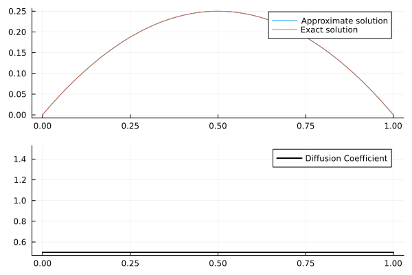 | 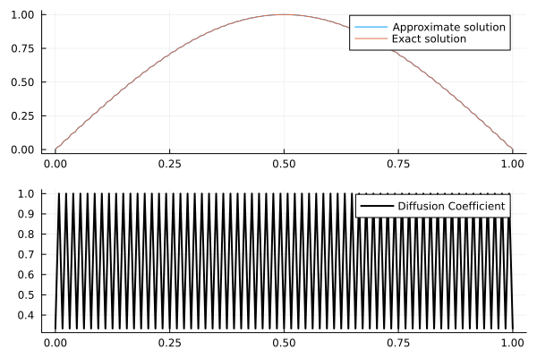 |  | 


### Heat equation in 1D

The script `HigherOrderMS/1d_heat_eqn.jl` contains the code to solve the transient heat equation in 1D. The spatial part is handled using the finite element method (both traditional and multiscale) and the temporal part is discretized using the fourth order (explicit) Runge Kutta method. The method is conditionally stable and a small time step is required to avoid instability. I use $h = 2^{-11}$ on the fine scale and $H=2^{-1}$ on the coarse scale. I set the oscillatory coefficient $D_{\varepsilon}(x)$ equal to

$$
D_{\varepsilon}(x) = \left(2 + \cos{\frac{2\pi x}{2^{-2}}}\right)^{-1}
$$

and the smooth coefficient 
$$
D_{\varepsilon}(x) = D_0 = 0.5
$$

In both cases, the right hand side $f(x,t) = 0$ and the initial condition $u_0(x) = \sin{\pi x}$. In the constant diffusion case, the exact solution can be obtained analytically and is equal to $u(x,t) = \exp{\left(-D_0 \pi^2 t\right)}u_0(x)$. This example can be used to study the convergence of the method.

| Smooth Diffusion Term | Oscillatory Diffusion Term |
| --- | --- |
| 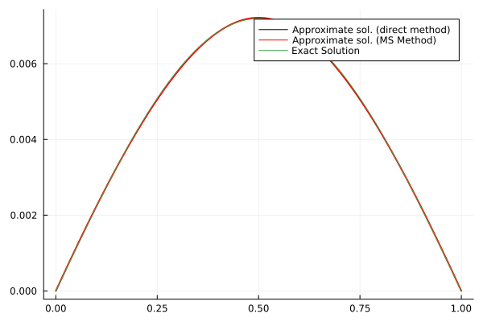 | 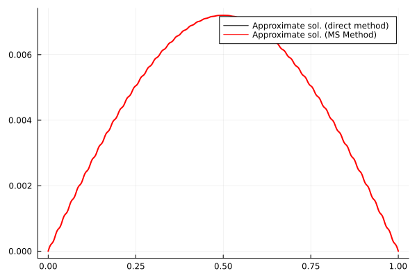 |

The main advantage of the multiscale method is that it provides an increase in computational efficiency. This is because: 

1) The linear system (on the coarse space) obtained after computing the multiscale basis is much smaller than the linear system obtained using the traditional method (on the fine space). Comparing the time taken to solve 100 iterations in the time marching step, we see that the multiscale method takes less time to complete the iterations. 

``` julia
  # nf = 2^11, nc = 2^1, Δt = 1e-4
  Running some benchmarks for 100 iterations...
  Direct Method takes:   296.866 ms (38800 allocations: 610.24 MiB)
  Multiscale Method takes:   138.934 ms (36700 allocations: 222.56 MiB)

  # nf = 2^4, nc = 2^1, Δt = 1e-4
  Running some benchmarks for 100 iterations...
  Direct Method takes:   6.400 ms (35600 allocations: 6.54 MiB)
  Multiscale Method takes:   2.526 ms (35900 allocations: 4.37 MiB)
```

2) Plus the CFL condition demands that the time step $\Delta t \lessapprox (\Delta x)^\alpha$ where $\Delta x$ is the spatial mesh size. For the multiscale method, since $H \gg h$, the CFL condition is much less strict compared to the traditional method. Thus we can compute the solution using much bigger time steps, while still capturing the small scale effects, resulting in a much more efficient method. 

<!-- Moreover, the traditional RK4-finite element method has a stability criterion that the time step $\Delta t \propto h^2$. This means applying the traditional method on fine meshes leads to an unstable method, if $\Delta t$ is chosen too large. However, the time step requirements for the RK4-multiscale method is much less strict as $\Delta t \propto H^2$. This can be seen when the problem is run with $h=2^{-11}$ where the traditional method fails, whereas the multiscale method gives a result that is close to the exact solution. Following plot summarizes the result.

| $h=2^{-4}$, $H=2^{-1}$ and $ \Delta t = 10^{-4}$ | $h=2^{-11}$, $H=2^{-1}$ and $ \Delta t = 10^{-4}$ |
| --- | --- |
|  | 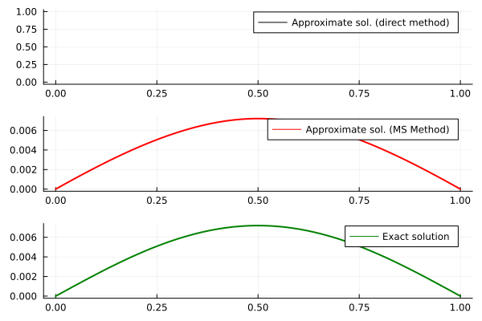 |  -->

### Wave equation in 1D

The script `HigherOrderMS/1d_wave_eqn.jl` contains the code to solve the acoustic wave equation in 1D. The spatial part is handled using the multiscale finite element method and the temporal part is discretized using Crank Nicolson scheme. I check two different wave speeds

$$
D_{\varepsilon}(x) = 4.0, \quad D_{\varepsilon}(x) = 4.0 + \left( \cos{\frac{2πx}{2^{-2}}} \right)
$$

In both cases, I set the right hand side $f(x,t) = 0$, the initial conditions $u(x,0) = 0$, $u_t(x,0) = 4\pi \sin\left(2\pi x\right)$. For the smooth wave speed case, the exact solution is given by $u(x,t) = \sin\left(2\pi x\right) \sin\left(4\pi t\right)$. Again we observe that the multiscale method gives a result that is close to the exact solution in the smooth case.

| Smooth wave speed | Oscillatory wave speed |
| --- | --- |
| 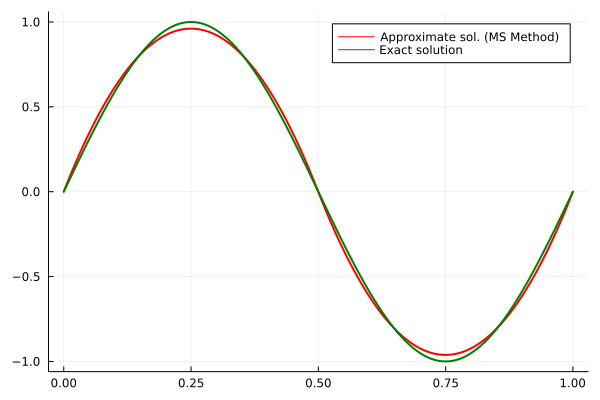 | 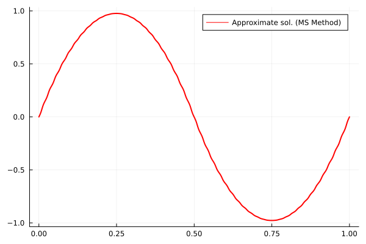 |

### Rate of convergence of the multiscale method
-------

All the rate of convergence examples can be found inside the folder `HigherOrderMS/`. The script `HigherOrderMS/rate_of_convergence_eg1.jl` contains the code to perform convergence analysis for the smooth diffusion case, whereas `HigherOrderMS/rate_of_convergence_eg2.jl` and `HigherOrderMS/rate_of_convergence_eg3.jl` contains the code to solve the problem with oscillatory and random diffusion coefficients, respectively.

#### Smooth Diffusion Coefficients
-------
The following figure shows the rate of convergence of the multiscale method for the lowest order case (`p=1` in the discontinuous space) and varying patch size, $l$. The example was run for a very smooth diffusion coefficient. Following is the test example:

$$
 -(A(x)u'(x))' = f(x) \quad in \quad x \in \Omega = (0,1),
$$

with 

$$
  A(x) = 1, \quad f(x) = \pi^2\sin(\pi x)
$$

The corresponding exact solution is $u(x) = \sin(\pi x)$. 

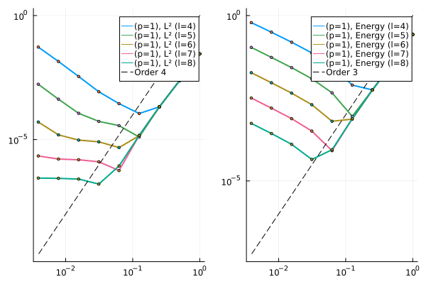 | 
--- |

We observe optimal convergence rates discussed in Maier, R., 2021 until the mesh size becomes too small. In that case a larger patch size (indicated by the parameter $l$) is required to obtain similar convergence rates for finer mesh. The growing part in the error is controlled by an $exp(-C_{dec} l)$ term and vanishes for higher value of $l$. 

 | 
--- |

This is in line with the observation made in Maier, R., 2021. Similar observations can be made for the higher-order case as well `(p=2)`. 

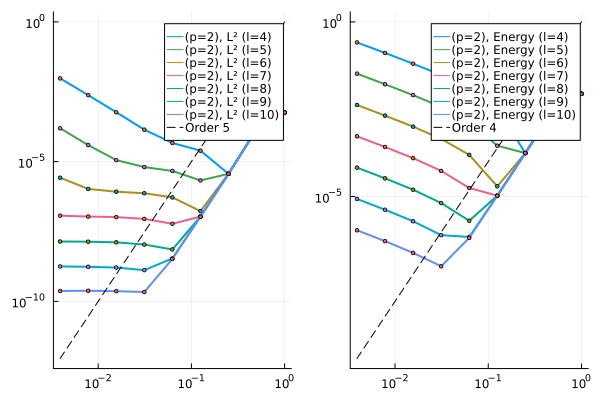 |
--- |

After eliminating the KDTree search, we can solve the problem upto the coarse-mesh size $H = 2^0, 2^{-1}, \cdots, 2^{-12}$ with the fine scale at $h=2^{-16}$. However, the method does not show convergence for very fine coarse-meshes unless the localization parameter is chosen high enough.

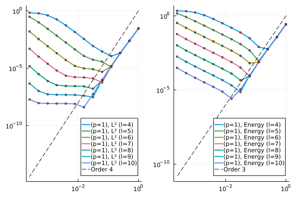 |
--- |

#### Oscillatory and Random Diffusion Coefficients
-------

Finally we can observe the same behaviour for the other choices of diffusion coefficients. The diffusion coefficients were chose identical to the ones discussed in the previous section. The right hand side data $f(x) = \frac{\pi^2}{2}\sin{\pi x}$ for the oscillatory case and $f(x) = \sin{5\pi x}$ for the random diffusion case.

Oscillatory coefficient | Random coefficients |
--- | --- |
 | 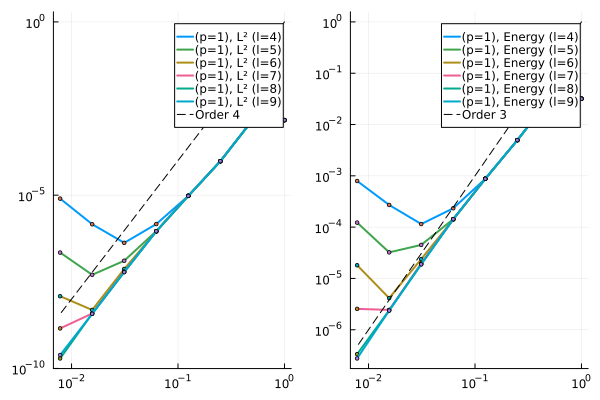 | 

## Localized Orthogonal Decomposition Method
-------

The localized orthogonal decomposition method implementation can be found inside the `LOD/` folder. The program `LOD/main.jl` contains the code to check the rate of convergence of the LOD method. The file `LOD/1dFunctions.jl` contains the routines to compute the standard finite element basis along with the functions assemble the global matrices. The file `LOD/1dFunctionsMultiScale` contains the code to compute the multi-scale basis along with the function to compute the $L^2$ error of the multiscale-FEM solution. Running the code `LOD/main.jl`. The multiscale basis corresponding to $(H=0.25)$ and $\varepsilon=2^{-5}$ along with the finite element solution and the rate of convergence for various mesh-size is shown below:


 |  |  | 
--- | --- | --- |

For more details on the method, refer to [Målqvist, A. et al](https://epubs.siam.org/doi/book/10.1137/1.9781611976458).


## References

- Målqvist, A. and Peterseim, D., 2020. Numerical homogenization by localized orthogonal decomposition. Society for Industrial and Applied Mathematics.
- Maier, R., 2021. A high-order approach to elliptic multiscale problems with general unstructured coefficients. SIAM Journal on Numerical Analysis, 59(2), pp.1067-1089.
