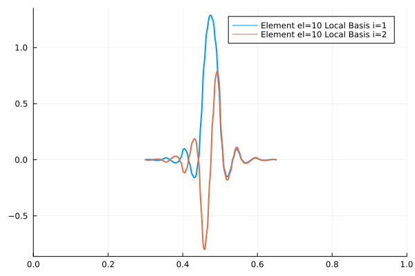
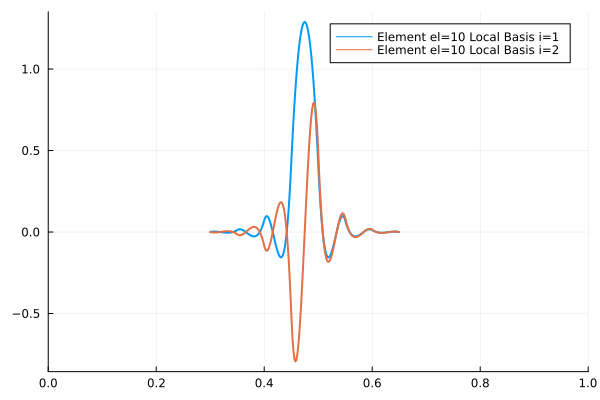
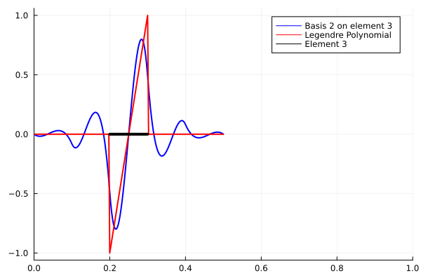
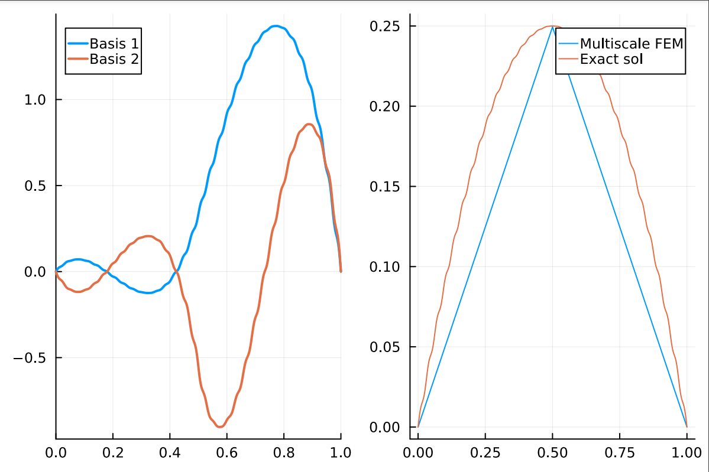
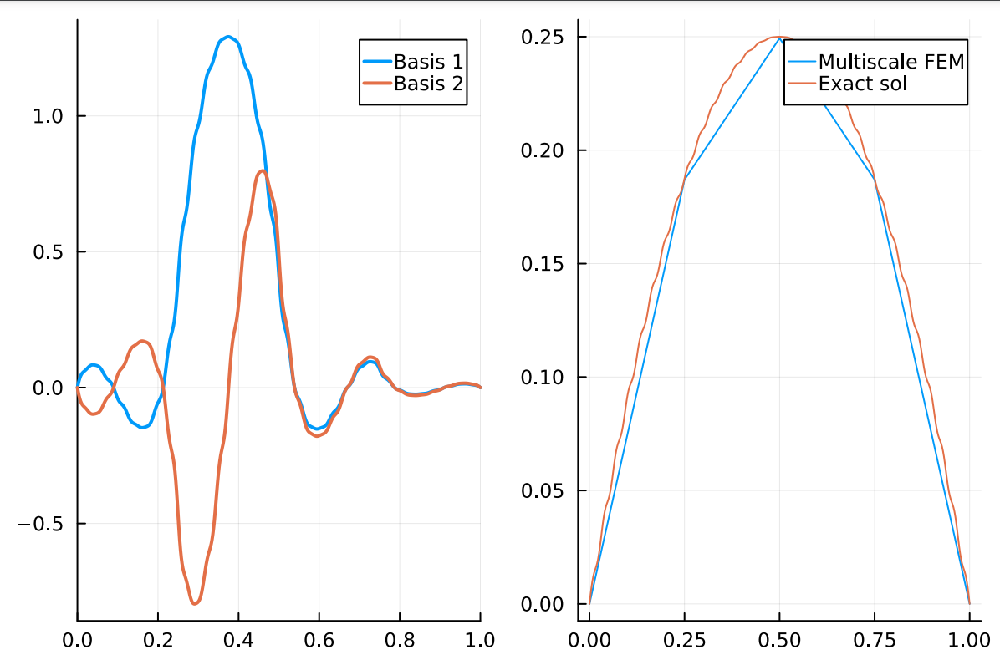
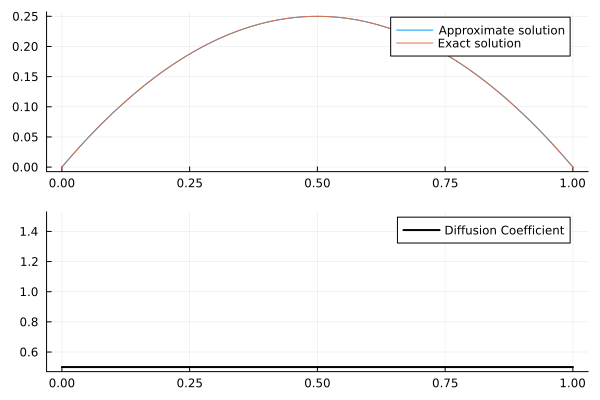
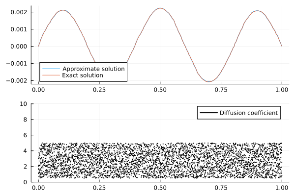
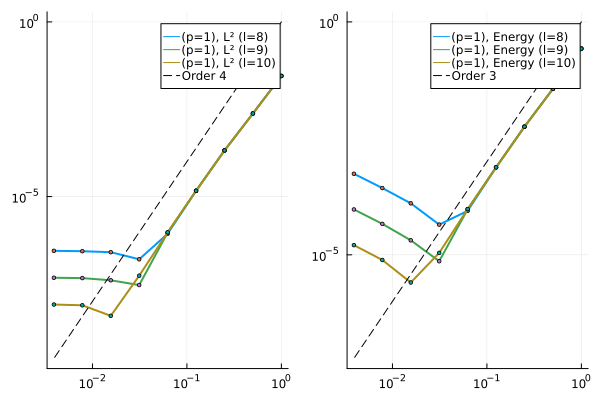

# MultiscaleFEM.jl

## Introduction

Contains the source code to implement the LOD method and the Higher order Multiscale Methods. We consider the following second order ODE

$$
    -(A_{\varepsilon}(x)u'(x))' = f(x) \quad in \quad x \in \Omega = (0,1),
$$

subject to the boundary conditions

$$
    u(0) = u(1) = 0.
$$

Here $A_{\varepsilon}$ is a highly oscillatory diffusion coefficient. For our simulations we assume

$$
    A_\varepsilon(x) = \left(2 + \cos{\frac{2\pi x}{\varepsilon}}\right)^{-1}, \quad f(x) = 1.
$$

The unique solution corresponding to the data is

$$
    u(x) = x - x^2 + \varepsilon\left( \frac{1}{4\pi} \sin{\left(\frac{2\pi x}{\varepsilon}\right)} - \frac{1}{2\pi}x\sin{\left(\frac{2\pi x}{\varepsilon}\right)} - \frac{\varepsilon}{4\pi^2}\cos{\left(\frac{2\pi x}{\varepsilon}\right)} + \frac{\varepsilon}{4\pi^2}\right).
$$

## Localized Orthogonal Decomposition Method

The localized orthogonal decomposition method implementation can be found inside the `LOD/` folder. The program `LOD/main.jl` contains the code to check the rate of convergence of the LOD method. The file `LOD/1dFunctions.jl` contains the routines to compute the standard finite element basis along with the functions assemble the global matrices. The file `LOD/1dFunctionsMultiScale` contains the code to compute the multi-scale basis along with the function to compute the $L^2$ error of the multiscale-FEM solution. Running the code `LOD/main.jl` 

```
julia> include("main.jl")
Done N=2, Discrete l∞ error = 1.1102230246251565e-16
Done N=4, Discrete l∞ error = 1.3877787807814457e-16
Done N=8, Discrete l∞ error = 2.7755575615628914e-16
Done N=16, Discrete l∞ error = 2.220446049250313e-16
```

We can observe that the point-wise error in the Multiscale solution and the exact solution is close to $10^{-16}$. This is because of the condition imposed during the construction of the Multi-scale finite element space, i.e., the error must vanish at the nodal points. The multiscale basis corresponding to $(H=0.25)$ and $\varepsilon=2^{-5}$ along with the finite element solution and the rate of convergence for various mesh-size is shown below:


 |  |  | 
--- | --- | --- |

For more details on the method, refer to [Målqvist, A. et al](https://epubs.siam.org/doi/book/10.1137/1.9781611976458).

## Higher order multiscale method

The higher order multiscale method is similar to the localized orthogonal decomposition method, but can be extended to the higher order setting. At the time of this writing, we have implemented only the construction of the modified basis. The implementation is based on the paper by [Maier, R.](https://epubs.siam.org/doi/abs/10.1137/20M1364321). This method is local upto the patch of size $l$ ouside the element. We then use the standard finite element on the patch to compute the projection of the $L^2$ functions on the coarse space. This mesh on the fine scale needs to sufficiently small to resolve the oscillations. This works since the problem is solved locally and often the oscillations could be captured on a reasonably small mesh. The code is given in `./HigherOrderMS/eg1.jl`. Sample multi-scale basis functions for $A_\varepsilon(x) = \left(2 + \cos{\frac{2\pi x}{\varepsilon}}\right)^{-1}$ (left) and $A_\varepsilon(x) = 1$ (right) is shown below:

 | |
--- | --- |

We can observe the oscillations in the fine scale for the highly oscillatory coefficients. The patch size of the element is $6$, meaning we take 3 (`l=3` in the code) elements on both sides of the element. We can also observe that the multiscale basis functions decay rapidly after about 3-4 elements in the patch. This indicates that the higher order basis elements has a larger patch and will lead to a denser final system of equations. A brief description of some functions are as follows:

- `𝒯 <:MeshType ` is a structure that stores the connectivity of the mesh. It can be initialized by passing the domain and the number of elements. `𝒯(domain::Tuple, N::Int64)`. The "sub-mesh" of the mesh can be obtained by passing the indices of the elements in the `𝒯` structure. The sub-mesh information is stored as the `Nˡ <:MeshType`. Eg.

``` julia
julia> mesh = 𝒯((0,1), 10) # Creates a mesh of 10 elements in (0,1)
𝒯(0.05, 0.0:0.05:1.0, [1 2; 2 3; … ; 19 20; 20 21])

julia> sub_mesh = mesh[1:3] # Extracts the submesh from elements 1-3. Useful in defining a patch providing the start and end indices.
Nˡ(0.05, 0.0:0.05:0.15, [1 2; 2 3; 3 4])
```

- `MatrixAssembler <: Assembler` is a structure that contains the assembly information of the global matrix. It depends on the kind of space you input along with the order of polynomial approximation. Eg. 

```julia
julia> Ω = 𝒯((0,1), 10);
julia> K = MatrixAssembler(H¹ConformingSpace(), 1, Ω.elems); # Creates an assembler for the innerproduct ∫(u*v)dΩ where u,v ∈ H¹(Ω). u and v are the corresponding Lagrange finite element (C⁰) basis functions.
julia> L = MatrixAssembler(H¹ConformingSpace(), L²ConformingSpace(), (1,1), (Ω.elems, Ω.elems); # Creates an assembler for the innerproduct ∫(u*v)dΩ where u ∈ H¹(Ω) and v ∈ L²(Ω). u and v are the Lagrange finite element (C⁰) functions and the Legendre polynomial (L²) basis functions, respectively.
```
    
- Similarly the `VectorAssembler <: Assembler` is a structure that contains the assembly information of the vectors. Can be called similarly to the `MatrixAssembler`, eg.,
``` julia
julia> F = VectorAssembler(L²ConformingSpace(), 1, Ω.elems);
```

- `H¹Conforming <: FiniteElementSpaces` is a structure that builds the $H^1$-conforming Lagrange polynomial space. It can be called by `H¹Conforming(mesh<:MeshType, p::Int64, DirichletNodes::Vector{Int64})`. The structure contains the basis functions on the reference element `(-1,1)`. The gradient of the basis function `ϕ(x::Real)` can be computed using `∇(ϕ,x::Real)`.

- `L²Conforming <: FiniteElementSpaces` is a structure that builds the $HL^2$-conforming Legendre polynomial space. It can be called by `L²Conforming(mesh<:MeshType, p::Int64)`. The structure contains the Legendre basis functions on the reference element `(-1,1)`. The gradient of the basis function `ϕ(x::Real)` can be computed using `∇(ϕ,x::Real)` **NOT WORKING, but not required in this problem**.

- `Rˡₕ` is a structure that contains the projection of an $L^2$ function. This can be done by calling the method `Rˡₕ()`. The following short program illustrates the use of `Rˡₕ`.

```julia
###################
### File eg2.jl ###
###################

# Include all the files.
include("meshes.jl");
include("assemblers.jl");
include("fespaces.jl");
include("basis_functions.jl")
include("local_matrix_vector.jl")
include("assemble_matrices.jl")

A(x) = @. 1; # Diffusion coefficient
n = 10; Nfine = 100; # Coarse and fine mesh size.
p = 1 # Polynomial orders for  L²
q = 2 # Polynomial orders for H¹

Ω = 𝒯((0,1),n); # The full coarse mesh.

start=1; last=5;
NˡK = Ω[start:last];# The submesh from element=start to element=last
VₕᵖNˡK = L²Conforming(NˡK, p); # The L²Conforming space on the coarse mesh

Ωₚ = (NˡK.nds[1], NˡK.nds[end]); # The submesh end points (defines the domain).
NˡKₕ = 𝒯(Ωₚ, Nfine); # Construct the mesh on the patch.
H¹₀NˡK = H¹Conforming(NˡKₕ ,q, [1,(q*Nfine+1)]); # The H¹Conforming space on the fine mesh with Dirichlet boundary conditions

Kₐ = MatrixAssembler(H¹ConformingSpace(), q, NˡKₕ.elems) # Construct the assembler for a(RˡₕΛₖ,v)
Lₐ = MatrixAssembler(H¹ConformingSpace(), L²ConformingSpace(), (q,p), (NˡKₕ.elems, NˡK.elems)) # Construct the assembler for (v,λ)
Fₐ = VectorAssembler(L²ConformingSpace(), p, NˡK.elems) # Construct the vector assembler for (Λₖ,μ)

# Bₖ is the Legendre polynomial with support K=(a,b)
function Bₖ(x,nds,V)        
  a,b=nds
  x̂ = -(a+b)/(b-a) + 2/(b-a)*x
  (a ≤ x ≤ b) ? V.basis(x̂) : zeros(Float64,V.p+1)
end

el = 3 # Element Index
local_basis = 2 # Local Basis Index 1:p+1
elem = Ω.nds[Ω.elems[el,1]:Ω.elems[el,2]]; # Get the nodes of element 3.

# Solve the saddle point problem. (Found in fespaces.jl, line 100)
RˡₕΛₖ = Rˡₕ(x->Bₖ(x,elem,VₕᵖNˡK)[local_basis], A, (H¹₀NˡK, VₕᵖNˡK), [Kₐ,Lₐ], [Fₐ]; qorder=4); 


using Plots
plt = plot(RˡₕΛₖ.nds, RˡₕΛₖ.Λ, label="Basis 2 on element 3", lc=:blue, lw=2)

# Legendre Polynomials basis at the FE nodes
LP = map(y->Bₖ(y,elem,VₕᵖNˡK)[local_basis], RˡₕΛₖ.nds); 

plot!(plt, RˡₕΛₖ.nds, LP, label="Legendre Polynomial", lc=:red, lw=2)
plot!(plt, elem[1]:0.01:elem[2], 0*(elem[1]:0.01:elem[2]), label="Element 3", lc=:black, lw=4)
xlims!(plt,(0,1))
```

 |
--- |

### Solution using the Multiscale method.

The model problem can be solved using the multiscale method and the program can be found in `eg3.jl`. We observe that the MS-method captures the microscale effects. The only requirement is that the number of points in the fine scale space should be enough to resolve the microscale effect in the diffusion coefficient. The figure below shows the basis functions of the second element along with the Multiscale-FEM nodal solution using 2 and 4 elements, respectively. 

 | 
--- | --- |

I solve this problem by invoking a nearest neighbour search to evaluate the basis function at arbitrary points. This is required as the mesh points in the coarse mesh may not coincide with the mesh points in the patch mesh. 

The script `SimplifiedHigherOrder/1dFunctions.jl` solves the one-dimensional Poisson problem using the HIgher-Order Multiscale method. The script contains three different diffusion coefficients:

$$
D_1(x) = 0.5, \quad D_2(x) = \left(2 + \cos{\frac{2\pi x}{2^{-6}}}\right)^{-1}, \quad D_3(x) = \text{rand}\left(0.5, 5.0;\, \epsilon = 2^{-12} \right).
$$

where $\epsilon = 2^{-12}$ denotes the scale of the randomness, i.e, the diffusion coefficient is constant at an interval of size $\epsilon$. We can observe that the multiscale method captures the exact solution accurately at small scales using relatively small elements (N=8).

| $ D(x) = 0.5, \quad f(x) = \pi^2\sin{\pi x} $ | $ D(x) = \left(2 + \cos{\frac{2\pi x}{2^{-6}}}\right)^{-1}, \quad f(x) = \pi^2\sin{(\pi x)}$ | $ D(x) = \text{rand}\left(0.5, 5.0;\, \epsilon = 2^{-12} \right), \quad f(x) = \sin{(5\pi x)}$ | 
| --- | --- | --- |
|  |  |  | 


### Rate of convergence of the multiscale method

All the rate of convergence examples can be found inside the folder `SimplifiedHigherOrder/`. 

The following figure shows the rate of convergence of the multiscale method for the lowest order case (`p=1` in the discontinuous space) and varying patch size. The example was run for a very smooth diffusion coefficient. Following is the test example:

$$
 -(A(x)u'(x))' = f(x) \quad in \quad x \in \Omega = (0,1),
$$

with 

$$
  A(x) = 1, \quad f(x) = \pi^2\sin(\pi x)
$$

The corresponding exact solution is $u(x) = \sin(\pi x)$. 

 | 
--- |

We observe optimal convergence rates (forgot to take the square root in the earlier version!) discussed in Maier, R., 2021 until the mesh size becomes too small. In that case a larger patch size (indicated by the parameter $l$) is required to obtain similar convergence rates for finer mesh. The growing part in the error is controlled by an $exp(-C_{dec} l)$ term and vanishes for higher value of $l$. 

 | 
--- |

This is in line with the observation made in Maier, R., 2021. Similar observations can be made for the higher-order case as well `(p=2)`. 

 |
--- |


## References

- Målqvist, A. and Peterseim, D., 2020. Numerical homogenization by localized orthogonal decomposition. Society for Industrial and Applied Mathematics.
- Maier, R., 2021. A high-order approach to elliptic multiscale problems with general unstructured coefficients. SIAM Journal on Numerical Analysis, 59(2), pp.1067-1089.
