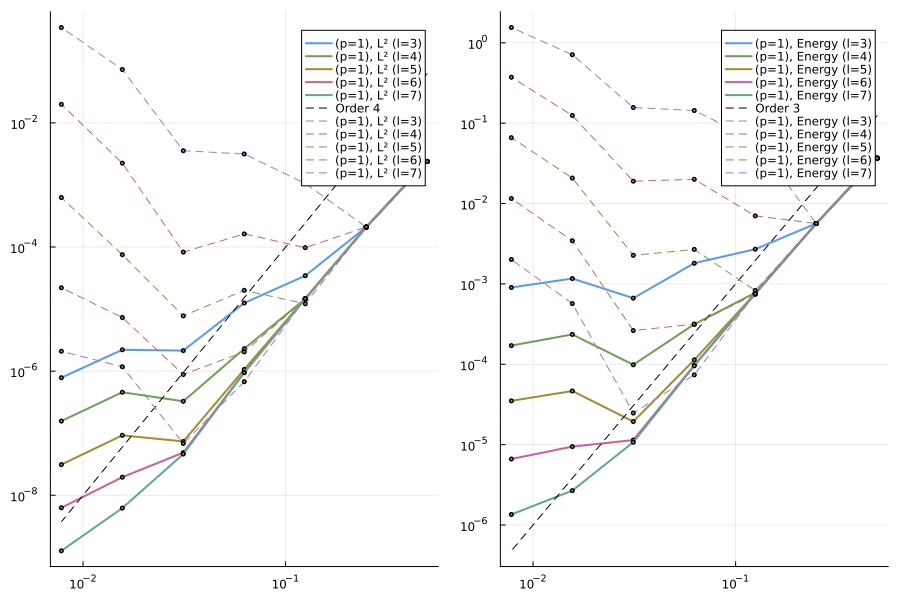
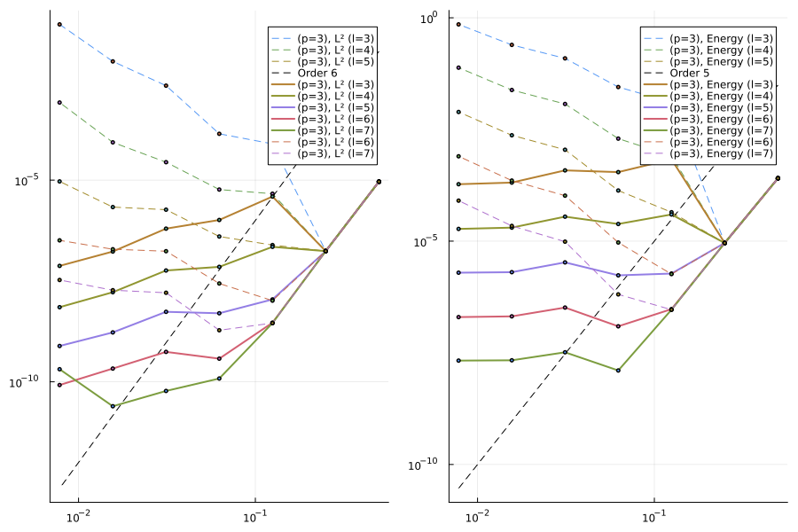
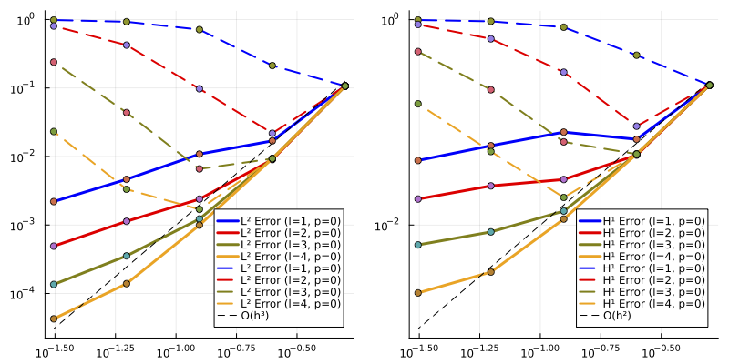
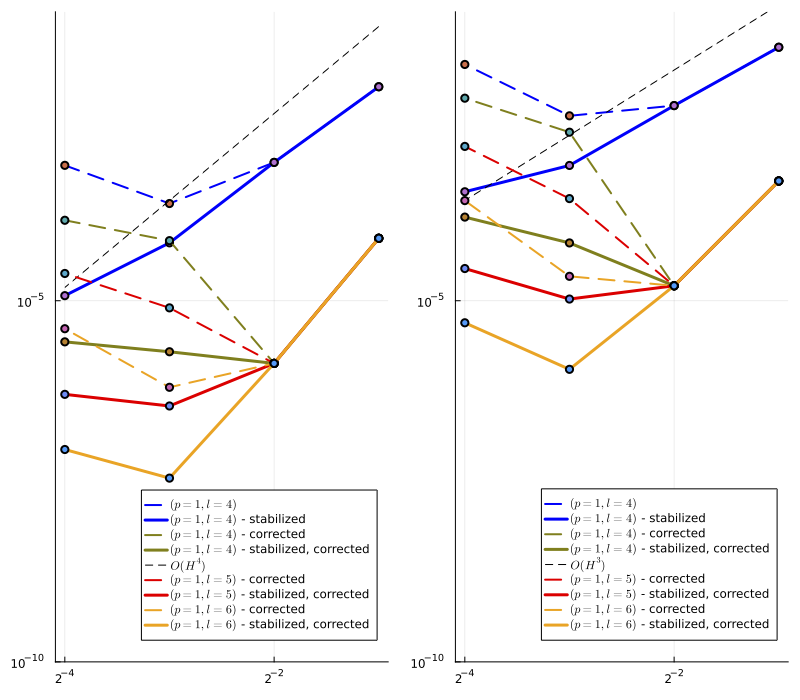

# MultiscaleFEM.jl

## Summary

- Contains the implementation of the High-order multiscale methods. The folder `HigherOrderMS` contains the 1D-implementation in one-dimension, and `HigherOrderMS_2d`, the 2D implementation.

## Code

### 1D:

The two examples are located in the main folder `HigherOrderMS/`. Run [`global-corrected-ms-method.jl`](https://github.com/Balaje/MultiScaleFEM.jl/blob/bubble_functions/HigherOrderMS/global-corrected-ms-method.jl) for the method with the additional corrections on the fine scale, i.e., $D\tilde{z}_H \in W_h \subset H^1_0(\Omega) \cap \ker \Pi_H$. This would be **MS Method + Global Method (Corrections)**. Run [`local-corrected-ms-method.jl`](https://github.com/Balaje/MultiScaleFEM.jl/blob/bubble_functions/HigherOrderMS/local-corrected-ms-method.jl) for the method with the basis for the additional corrrection. This would be **MS Method + MS Method (Corrections)** for the additional corrections. Here is a summary:

File | Additional Corrections | Stabilization |
--- | --- | --- |
`global-corrected-ms-method.jl` | Yes (Global) | No |
`local-corrected-ms-method.jl` | Yes (Local) | No |

Results of the Stabilized Multiscale Method for the Poisson equation:

Oscillatory Diffusion (p=1) | Oscillatory Diffusion (p=3) | 
--- | --- |
 |  |

### 2D:

The examples are located in `HigherOrderMS_2d/examples/2d_examples/`. Run [`2d_Heat.jl`](https://github.com/Balaje/MultiScaleFEM.jl/blob/bubble_functions/HigherOrderMS_2d/examples/2d_examples/2d_Heat.jl) for the method without the additional corrections. So, this would just be the **MS Method $\pm$ Stabilization**. Run [`2d_Heat_Corrected.jl`](https://github.com/Balaje/MultiScaleFEM.jl/blob/bubble_functions/HigherOrderMS_2d/examples/2d_examples/2d_Heat_Corrected.jl) for the method with the additional corrections with/without stabilization. This would be method that we are interested in: **MS Method + MS Method (Corrections) $\pm$ Stabilization**. I left comments about how to enable/disable the stabilization part. Here is a summary:

File | Additional Corrections | Stabilization |
--- | --- | --- |
`2d_Heat.jl` | No | Yes |
`2d_Heat_Corrected.jl` | Yes | Yes |

Examples pictures the stabilized multiscale methods for the Poisson Problem and the Heat Equation:

Poisson Equation | Heat Equation |
--- | --- |
 | 

## What's missing?

- In 1D, the stabilization part is available only in the Poisson problem code [`1d_rate_of_convergence_Poisson.jl`](https://github.com/Balaje/MultiScaleFEM.jl/blob/bubble_functions/HigherOrderMS/1d_rate_of_convergence_Poisson.jl).
- High-precision arithmetic for 2D.
- Better Documentation.
- Merge the 1D and 2D implementation into a single package. The 2D version is already in the form of a package, and the 1D version simply needs to be moved in. (Optional for now.)

## References

- Målqvist, A. and Peterseim, D., 2020. Numerical homogenization by localized orthogonal decomposition. Society for Industrial and Applied Mathematics.
- Maier, R., 2021. A high-order approach to elliptic multiscale problems with general unstructured coefficients. SIAM Journal on Numerical Analysis, 59(2), pp.1067-1089.
- Abdulle, A. and Henning, P., 2017. Localized orthogonal decomposition method for the wave equation with a continuum of scales. Mathematics of Computation, 86(304), pp.549-587.
- Dong, Z., Hauck, M., & Maier, R. (2023). An improved high-order method for elliptic multiscale problems. SIAM Journal on Numerical Analysis, 61(4), 1918-1937.
- Krumbiegel, F., & Maier, R. (2024). A higher order multiscale method for the wave equation. IMA Journal of Numerical Analysis, drae059.
