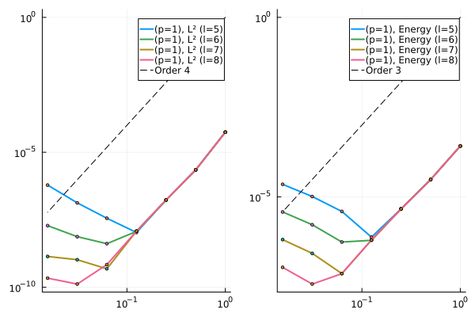
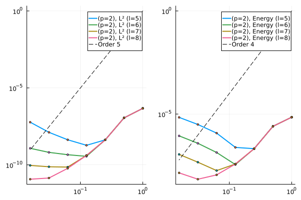
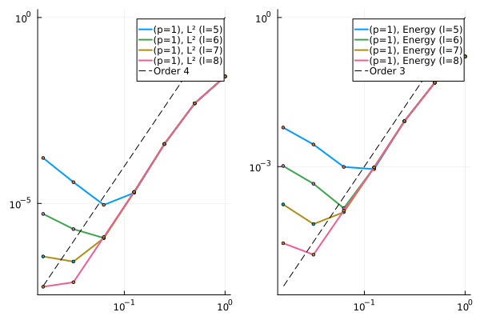
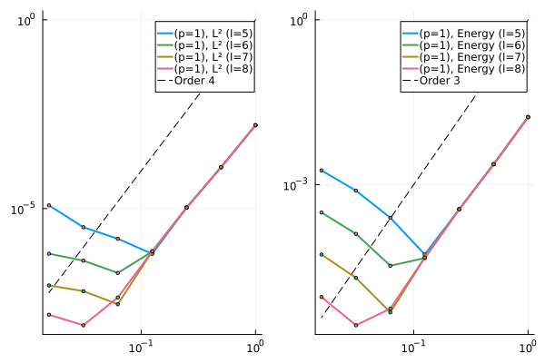
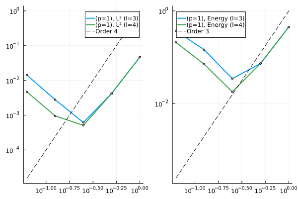

# MultiscaleFEM.jl

- [Summary](#summary)
- [Introduction](#introduction)
- [Higher order multiscale method](#higher-order-multiscale-method)
  * [Poisson equation in 1D](#poisson-equation-in-1d)
  * [Heat equation in 1D](#heat-equation-in-1d)
  * [Wave equation in 1D](#wave-equation-in-1d)
  * [Rate of convergence of the multiscale method](#rate-of-convergence-of-the-multiscale-method)
    + [Poisson Equation](#poisson-equation)
      - [Smooth Diffusion Coefficients](#smooth-diffusion-coefficients)
      - [Oscillatory and Random Diffusion Coefficients](#oscillatory-and-random-diffusion-coefficients)
    + [Time dependent problems](#time-dependent-problems)
      - [Heat equation](#heat-equation)
        * [Smooth Diffusion coefficient](#smooth-diffusion-coefficient)
        * [Oscillatory Diffusion coefficient](#oscillatory-diffusion-coefficient)
        * [Random diffusion coefficient](#random-diffusion-coefficient)
        * [Some more tests for random diffusion coefficients](#some-more-tests-for-random-diffusion-coefficients)
      - [Wave Equation](#wave-equation)
        * [Smooth Wave-speeds](#smooth-wave-speeds)
        * [Oscillatory wave-speed without well-prepared data](#oscillatory-wave-speed-without-well-prepared-data)
        * [Oscillatory wave-speed with well-prepared data](#oscillatory-wave-speed-with-well-prepared-data)
        * [Random wave-speed](#random-wave-speed)
        * [Random wave-speed solved for large final time](#random-wave-speed-solved-for-large-final-time)
- [Localized Orthogonal Decomposition Method](#localized-orthogonal-decomposition-method)
- [Implementation of the Higher Order Multiscale Method in two dimensions](#implementation-of-the-higher-order-multiscale-method-in-two-dimensions)
  * [The Coarse-To-Fine map](#the-coarse-to-fine-map)
  * [Patch information](#patch-information)
  * [The Multiscale bases](#the-multiscale-bases)
  * [Solution to the multiscale method](#solution-to-the-multiscale-method)
- [References](#references)

## Summary

Key: 
 - :heavy_check_mark: Optimal convergence
 - :heavy_multiplication_x: No convergence whatsoever.
 - :question: Optimal convergence for a few mesh points, but then slows down.

**Poisson Equation**

Method | `p=1` | `p=2` | `p=3` |
 --- | --- | --- | --- |
Constant/Smooth Coefficient | :heavy_check_mark: | :heavy_check_mark: | :heavy_check_mark: |
Oscillatory Coefficient | :heavy_check_mark: | :heavy_check_mark: | :heavy_check_mark: |
Random Coefficient | :heavy_check_mark: | :heavy_check_mark: | :heavy_check_mark: |

**Heat Equation**

Method | `p=1` | `p=2` | `p=3` |
 --- | --- | --- | --- |
Constant/Smooth Coefficient | :heavy_check_mark: | :heavy_check_mark: | :heavy_check_mark: |
Oscillatory Coefficient | :heavy_check_mark: | :question: | :question: |
Random Coefficient | :heavy_check_mark: | :question: | :question: |

**Wave Equation**

Method | `p=1` | `p=2` | `p=3` |
 --- | --- | --- | --- |
Constant/Smooth Coefficient | :heavy_check_mark: | :heavy_check_mark: | :heavy_check_mark: |
Oscillatory Coefficient (Without well-prepared initial data) | :heavy_multiplication_x: | :heavy_multiplication_x: | :heavy_multiplication_x: |
Oscillatory Coefficient (With well-prepared initial data) | :heavy_check_mark: | :question: | :question: |
Random Coefficient | :heavy_check_mark: | :question: | :question: |

## Introduction

This repository contains the source code to implement the Localized Orthogonal Decomposition method and the Higher order Multiscale Method to solve the Poisson problem

$$
\begin{align*}
    -(D_{\varepsilon}(x)u'(x))' = f(x) &\quad x \in \Omega = (0,1),\\
    u(0) = u(1) = 0,
\end{align*}
$$

the heat equation supplemented with initial and boundary conditions 

$$
\begin{align*}
  u_t(x,t) - (D_{\varepsilon}(x)u_x(x,t))_x = f(x,t) &\quad (x,t) \in (0,1) \times (0,\infty),\\
  u(x,0) = u_0(x) &\quad x \in (0,1),\\
  u(0,t) = u(1,t) =0 &\quad t \in (0,\infty),
\end{align*}
$$

and the wave equation

$$
\begin{align*}
  u_{tt}(x,t) - (D_{\varepsilon}(x)u_x(x,t))_x = f(x,t) &\quad (x,t) \in (0,1) \times (0,\infty),\\
  u(x,0) = u_0(x) &\quad x \in (0,1),\\
  u_t(x,0) = u_1(x) &\quad x \in (0,1),\\
  u(0,t) = u(1,t) =0 &\quad t \in (0,\infty),
\end{align*}
$$

Here $D_{\varepsilon}$ is a highly oscillatory coefficient. Traditional methods often need very small meshes to resolve the oscillations on the fine scale and thus we turn to multiscale methods.

## Higher order multiscale method
-------

The implementation is based on the paper by [Maier, R.](https://epubs.siam.org/doi/abs/10.1137/20M1364321). This method is local upto the patch of size $l$ outside the element. I use the standard finite element method on the patch to compute the projection of the $L^2$ functions on the coarse space. This mesh on the fine scale needs to be sufficiently small to resolve the fine scale effects. Since the problem is solved locally, the fine-scale effects could be captured using reasonably large mesh on the patch. 

The new basis function then contains the fine scale information and can be used to find the numerical solution that contains the information on the fine scale. This needs to be computed once and can be used repeatedly, for example, to solve time dependent problems. For example, the following figure shows the multiscale basis function containing the fine scale information. 

| Smooth Diffusion Coefficient | Oscillatory Coefficient | 
| --- | --- |
|  | 

The smooth diffusion coefficient does not contain any oscillations and hence the multiscale bases are smooth. If the diffusion coefficient is oscillatory, then the information is captured by the multiscale bases function. The diffusion coefficient for the oscillatory case here is assumed to be

$$
D(x) = \left(1 + 0.8\cos\left(\frac{2\pi x}{2^{-5}}\right)\right)^{-1}
$$

whereas the constant diffusion is 

$$
D(x) = 1
$$

Most of the current implementation relies on [Gridap.jl](https://github.com/gridap/Gridap.jl) for computing the fine scale stiffness matrix, load vector, the $L^2$-and $H^1$-error etc. I then employ a suitable $L^2$-bases to construct the remaining part of the saddle point system and then obtain the bases. 

### Poisson equation in 1D

The script `HigherOrderMS/1d_Poisson_eq.jl` contains the code to solve the one-dimensional Poisson problem using the Higher Order Multiscale method. I show the results three different diffusion coefficients:

$$
D_{\varepsilon}(x) = 0.5, \quad D_{\varepsilon}(x) = \left(2 + \cos{\frac{2\pi x}{2^{-6}}}\right)^{-1}, \quad D_{\varepsilon}(x) = \text{rand}\left(0.5, 5.0;\, \epsilon = 2^{-12} \right).
$$

where $\epsilon = 2^{-12}$ denotes the scale of the randomness, i.e, the diffusion coefficient is constant at an interval of size $\epsilon$. We can observe that the multiscale method captures the exact solution accurately at small scales using relatively small elements `(N=8)` in the coarse space. The fine-scale mesh size was taken to be equal to $h = 2^{-15}$.

| Smooth Diffusion Term | Oscillatory Diffusion Term | Random Diffusion Term |
| --- | --- | --- |
|  |  |  | 


### Heat equation in 1D

The script `HigherOrderMS/1d_heat_equation.jl` contains the code to solve the transient heat equation in 1D. The spatial part is handled using the finite element method (both traditional and multiscale) and the temporal part is discretized using the fourth order backward difference formula (BDF4). I use $h = 2^{-11}$ on the fine scale and $H=2^{-1}$ on the coarse scale, the (oscillatory) diffusion coefficient $D_{\varepsilon}(x)$ equal to

$$
D_{\varepsilon}(x) = \left(2 + \cos{\frac{2\pi x}{2^{-2}}}\right)^{-1}
$$

and the (smooth) coefficient 

$$
D_{\varepsilon}(x) = D_0 = 0.5
$$

In both cases, the right hand side $f(x,t) = 0$ and the initial condition $u_0(x) = \sin{\pi x}$. In the constant diffusion case, the exact solution can be obtained analytically and is equal to $u(x,t) = \exp{\left(-D_0 \pi^2 t\right)}u_0(x)$. Following figure shows the solution obtained using the multiscale method.  

| Smooth Diffusion Term | Oscillatory Diffusion Term |
| --- | --- |
|  |  |


### Wave equation in 1D

The script `HigherOrderMS/1d_wave_equation.jl` contains the code to solve the acoustic wave equation in 1D. The spatial part is handled using the multiscale finite element method and the temporal part is discretized using Crank Nicolson scheme. I check two different wave speeds

$$
D_{\varepsilon}(x) = 4.0, \quad D_{\varepsilon}(x) = \left(0.25 + 0.125\cos\left(\frac{2\pi x}{2\times 10^{-2}}\right)\right)^{-1}
$$

In both cases, I set the right hand side $f(x,t) = 0$, the initial conditions $u(x,0) = 0$, $u_t(x,0) = 4\pi \sin\left(2\pi x\right)$. For the smooth wave speed case, the exact solution is given by $u(x,t) = \sin\left(2\pi x\right) \sin\left(4\pi t\right)$. We observe that the multiscale method gives a good approximation to the exact solution (smooth wave speed).

| Smooth wave speed | Oscillatory wave speed |
| --- | --- |
|  |  |


### Rate of convergence of the multiscale method
-------

All the rate of convergence examples can be found inside the folder `HigherOrderMS/`. 

#### Poisson Equation

The script `HigherOrderMS/1d_rate_of_convergence_Poisson.jl` contains the code to study the convergence rates for the Poisson equation. To obtain the rate of convergence plots, we always assume that the exact solution is obtained by solving the problem using the traditional finite element method. This is because, in majority of the examples considered here, the exact solution is not known.

##### Smooth Diffusion Coefficients

The following figure shows the rate of convergence of the multiscale method for the lowest order case (`p=1` in the discontinuous space) and varying patch size, $l$. The example was run for a smooth diffusion coefficient. Following is the test example:

$$
 -(A(x)u'(x))' = f(x) \quad in \quad x \in \Omega = (0,1),
$$

with 

$$
  A(x) = 1, \quad f(x) = \pi^2\sin(\pi x)
$$

The corresponding exact solution is $u(x) = \sin(\pi x)$. 

 | 
--- |

We observe optimal convergence rates discussed in Maier, R., 2021 until the mesh size becomes too small. In that case a larger patch size (indicated by the parameter $l$) is required to obtain similar convergence rates for finer mesh. The growing part in the error is controlled by an $exp(-C_{dec} l)$ term and vanishes for higher value of $l$. 

 | 
--- |

This is in line with the observation made in Maier, R., 2021. Similar observations can be made for the higher-order cases as well, `(p=2)` and `(p=3)`. 

`(p=2)` | `(p=3)` |
--- | --- |
 |  |

We can solve the problem upto the coarse-mesh size $H = 2^0, 2^{-1}, \cdots, 2^{-12}$ with the fine scale at $h=2^{-16}$. However, the method does not show convergence for very fine coarse-meshes unless the localization parameter is chosen high enough.

 |
--- |

##### Oscillatory and Random Diffusion Coefficients

Finally we can observe the same behaviour for the other choices of diffusion coefficients. The diffusion coefficients were chose identical to the ones discussed in the previous section. The right hand side data $f(x) = \frac{\pi^2}{2}\sin{\pi x}$ for the oscillatory case and $f(x) = \sin{5\pi x}$ for the random diffusion case.

Oscillatory coefficient | Random coefficients |
--- | --- |
 |  | 

#### Time dependent problems
-------

##### Heat equation

###### Smooth Diffusion coefficient

I solve the following parabolic initial boundary value problem using the multiscale method `(HigherOrderMS/rate_of_convergence_Heat_Equation.jl)`.

$$
\begin{align*}
  u_t - (A(x)u_x(x,t))_x = 0 &\quad (x,t) \in (0,1) \times (0,T),\\
  u(x,0) = \sin(\pi x) &\quad x \in (0,1),\\
  u(0,t) = u(1,t) =0 &\quad t \in (0,T),
\end{align*}
$$

I take $h = 2^{-16}$ and $H = 2^0, 2^{-1}, \cdots, 2^{-7}$. In the temporal direction, I set $\Delta t = 10^{-3}$ and solve till final time $T = 1.0$. I use the fourth order backward difference formula for discretizing the temporal part. The exact solution was taken to be the standard finite element solution on a mesh whose size is $h=2^{-15}$. I compute the rate of convergence for the smooth diffusion coefficient 

$$
A(x) = 1.0,
$$


`(p=1)` | `(p=2)` | `(p=3)` |
--- | --- | --- |
 |  |  |

Testing with the non-constant smooth diffusion coefficient:

$$
A(x) = \left(2 + \cos \left(\frac{2π x}{2^{-1}}\right) \right)^{-1}
$$

`(p=1)` | `(p=2)` | `(p=3)` |
--- | --- | --- |
 |  |  |

The convergence seems to be optimal in all cases.

###### Oscillatory Diffusion coefficient

I test the above initial boundary value problem with the following oscillatory diffusion coefficient:

$$
A(x) = \left(2 + \cos \left(\frac{2π x}{2^{-6}}\right) \right)^{-1}
$$

`(p=1)` | `(p=2)` | `(p=3)` |
--- | --- | --- |
 |  |  |

In case of `p=1`, the method seems to show optimal convergence rates for most values of $H$, but for `p=2,3` the convergence rates deteriorate significantly. Not sure if this is expected for the highly oscillatory case. Let us now proceed to random coefficients.

###### Random diffusion coefficient

Finally, I test the problem for random-coefficients which are piecewise-constant on the scale $\epsilon = 2^{-12}$. 

`(p=1)` | `(p=2)` |
--- | --- |
 |  | 

`(p=3)` | Random Diffusion Coefficient | 
--- | --- |
 |  |


The method again shows optimal convergence for `p=1` but seem to slightly deteriorate for `p=2,3` as the mesh-size decreases. This can be seen in the case of the wave equation as well, which will be covered later.

###### Some more tests for random diffusion coefficients

We perform a few more tests for the heat equation. Consider the following problem 

$$
\begin{align*}
  u_t - (A(x)u_x(x,t))_x = f(x,t) &\quad (x,t) \in (0,1) \times (0,T),\\
  u(x,0) = u_0(x) &\quad x \in (0,1),\\
  u(0,t) = u(1,t) =0 &\quad t \in (0,T),
\end{align*}
$$

I take the diffusion coefficient 

$$ 
A(x) = \text{rand}\left(0.5,1, \epsilon = 2^{-12}\right)
$$

and solve the problem using the multiscale method using `p=3`. I take the coarse mesh size $H=2^{-1}, 2^{-2}, 2^{-3}, \cdots 2^{-7}$ with the background fine scale discretization set at $h = 2^{-15}$. I use the 4th order Backward Difference Formula (BDF-4) to discretize the temporal direction. I take the time step size $\Delta t = 10^{-3}$ and solve till final time $T=0.5$ s. I consider the following cases:

1. **Case 1:** $f(x,t) = \sin (\pi x) \sin(\pi t), \, u_0(x) = 0.$

    We observe that the convergence rates are suboptimal for the higher order multiscale method `(p=3)` as $H \to 0$. However, the rate seems to be optimal for the first two mesh sizes. 

    `(p=3)` |
    --- |
     |

    ``` julia
    L²Error = 
    [6.904026225412479e-5, 
    9.994602736284981e-7, 
    3.897034713700309e-8, 
    3.802574439053447e-9, 
    9.080179587634707e-10, 
    1.3381403737114586e-10, 
    4.2318825691302157e-11, 
    3.8970415993978335e-11]

    log.(L²Error[2:end] ./ L²Error[1:end - 1]) ./ log(0.5) = 
    [6.110144910356789, 
    4.680700536317692, 
    3.357328387207551, 
    2.0661837538612366, 
    2.7624913657642014, 
    1.66085796597924, 
    0.1189202627442888]
    ```

2. **Case 2:** $f(x,t) = 0, \, u_0(x) = \sin (\pi x).$

    Again, we observe that the convergence rates are suboptimal for the higher order multiscale method `(p=3)` as $H \to 0$. However, the rate seems to be suboptimal earlier than observed in **Case 1**.

    `(p=3)` |
    --- |
     |

    The rate of convergence and the error magnitudes are as follows:   

    ```julia
    L²Error = 
    [1.7875148956715388e-5, 
    3.524163429947011e-7, 
    2.3963586522072257e-8, 
    7.319979871768478e-9, 
    1.219071871938366e-9, 
    1.7618198430902445e-10, 
    4.3432779965066374e-11, 
    2.448469254518588e-11]

    log.(L²Error[2:end] ./ L²Error[1:end - 1]) ./ log(0.5) = 
    [5.664530624433729, 
    3.8783650784416164, 
    1.7109322594020788, 
    2.586056497047787, 
    2.79064487191708, 
    2.0202102051473467, 
    0.8269042168959881]    
    ```

##### Wave Equation

I solve the following wave equation along with the prescribed initial and boundary conditions

$$
\begin{align*}
  u_{tt} - \left(c^2(x)u'(x,t)\right)' = 0 &\quad (x,t) \in (0,1) \times (0,T),\\
  u(x,0) = 0 &\quad x \in (0,1),\\
  u_t(x,0) = \pi \sin(\pi x) &\quad x \in (0,1),\\
  u(0,t) = u(1,t) =0 &\quad t \in (0,T),
\end{align*}
$$

using the multiscale method in space and Crank-Nicolson method in time. For the temporal discretization, I assume $\Delta t = 10^{-3}$ and solve till final times $T = 1.5$ s. Here I consider three wave speeds

Constant Wave Speed | Smooth Wave Speed | Oscillatory Wave Speed | 
--- | --- | --- |
 |  |  |

###### Smooth Wave-speeds

First, I assume that the wave speed $c(x) = 1.0$. The exact solution is assumed to be the numerical solution obtained using the standard finite element method on a fine mesh of size $h=2^{-15}$. I take the coarse mesh size $H = 2^0, 2^{-1}, \cdots, 2^{-6}$ to study the convergence rates. Following plots show the rate of convergence of the multiscale method in space for `(p=1,2,3)`:

`(p=1)` | `(p=2)` | `(p=3)` |
--- | --- | --- |
  |   |   | 

I observe that for constant wave speed case, the method converges with the optimal convergence rates. I now solve the problem with the following data

$$
\begin{align*}
  u_{tt} - \left(c^2(x)u'(x,t)\right)' = 0 &\quad (x,t) \in (0,1) \times (0,T),\\
  u(x,0) = 0 &\quad x \in (0,1),\\
  u_t(x,0) = \pi \sin(\pi x) &\quad x \in (0,1),\\
  u(0,t) = u(1,t) =0 &\quad t \in (0,T),
\end{align*}
$$

Now I use a smooth, but non-constant wave speed $c^2(x) = \left(0.25 + 0.125\cos\left(\pi x\right)\right)^{-1}$ (shown above). Again, I observe optimal convergence rates when I solve till $T=1.5$ s.

`(p=1)` | `(p=2)` | `(p=3)` |
--- | --- | --- |
  |   |   | 

###### Oscillatory wave-speed without well-prepared data

Now I solve the same problem keeping the initial and boundary data same, but with an oscillatory wave speed $c^2(x) = \left(0.25 + 0.125\cos\left(\frac{2\pi x}{2\times 10^{-2}}\right)\right)^{-1}$. Here I observe that the method does not show any convergence. This may be due to the initial data not being "well-prepared", which is an assumption to obtain optimal convergence rates. 

`(p=1)` | `(p=2)` | `(p=3)` |
--- | --- | --- |
  |  |   | 

###### Oscillatory wave-speed with well-prepared data

However, if I consider this problem

$$
\begin{align*}
  u_{tt} - \left(c^2(x)u'(x,t)\right)' = f(x,t) &\quad (x,t) \in (0,1) \times (0,T),\\
  u(x,0) = 0 &\quad x \in (0,1),\\
  u_t(x,0) = 0 &\quad x \in (0,1),\\
  u(0,t) = u(1,t) =0 &\quad t \in (0,T),
\end{align*}
$$

with 

$$
c^2(x) = \left(0.25 + 0.125\cos\left(\frac{2\pi x}{2^{-5}}\right)\right)^{-1}, \quad f(x,t) = \sin(\pi x)\sin(t),
$$

and solve the problem till $T=1.5$ s, we observe the following convergence rates.

`(p=1)` | `(p=2)` | `(p=3)` |
--- | --- |  --- |
 |  |  | 

###### Random wave-speed

Next, I show the rate of convergence results for a random piecewise-constant in a on the scale $\epsilon = 2^{-12}$ with randomly chosen values in $[0.5,5]$. The choice of wave forcing and the initial conditions are the same as that of the well prepared case. I solve the problem till the final time reaches $T=1.5$ s. I generally observe optimal convergence in all the cases.

 Random Wave Speed | `(p=1)` |
--- | --- | 
 |  |

| `(p=2)` | `(p=3)` |
--- | --- |
  |  |

The errors and the convergence rates for `p=3` and `l=7,8` are as follows

``` julia
L²Error, log.(L²Error[2:end]./L²Error[1:end-1])./log(0.5) =  
 2.813836726235343e-5,     -
 4.988827991816158e-7,     5.817693879953462
 1.1127711098892783e-8,    5.486472153096103
 1.7775346709062124e-9,    2.6462072647066717
 4.0414836315938045e-10,   2.1369207902329976
 1.3890518527993854e-10,   1.5407845490107315
 1.556413958602914e-10,   -0.16412536859864296
```

 ``` julia
H¹Error, log.(H¹Error[2:end]./H¹Error[1:end-1])./log(0.5) = 
 0.0005317826685733046,   -
 1.6555166712390332e-5,   5.005483314800532
 6.961151076781885e-7,    4.57181184280305,
 2.251135974344496e-7,    1.6286726840033017,
 8.721593380331359e-8,    1.3679895663609516,
 9.539812707649906e-8,   -0.1293692120953031,
 2.0509237859631738e-7,  -1.104241033451946
 ```

When we solve the wave equation with the randomness scale set to be $\epsilon = 2^{-8}$ and solve till $T=1.5$ s, we observe the following errors and rates:

``` julia
L²Error, log.(L²Error[2:end]./L²Error[1:end-1])./log(0.5)      

 2.4973677290913234e-5,     -
 5.646129507711419e-7,      5.4670022378419265
 9.116253023241141e-8,      2.6307493483547644
 1.2071136444360103e-8,     2.9168794615446694
 1.605128486309087e-9,      2.9108008148523816
 2.9510372535522345e-10,    2.443394747496892
 7.85316512435051e-11,      1.909875995981362
```

We observe that the rates are $\approx 3$ till the localization errors start to build up. We also check for $\epsilon = 2^{-7}$ and solve till the same final time

``` julia
L²Error, log.(L²Error[2:end]./L²Error[1:end-1])./log(0.5)

 2.6780674534387508e-5,     -     
 8.601669221126228e-7,      4.960431835339351
 1.6739196120415372e-7,     2.361386407356178
 2.537291230911504e-8,      2.7218692189626443
 4.299557632978447e-9,      2.5610289832744635
 7.310267033088037e-10,     2.556192221672045
 8.419981395955944e-11,     3.1180351558689683
```

Again, we observe that the rates are approx $\approx 3$. The following figure summarizes the result


The choice of the time-step method also seems to influence the convergence rates. We consider the Newmark-Beta method with $\beta=0.25, \gamma=0.5$ which leads to the Crank Nicolson Method (an implicit scheme) and the choice $\beta=0.0, \gamma=0.5$ leads to the Leap-Frog Method (an explicit scheme).

https://github.com/Balaje/MultiScaleFEM.jl/blob/4e5f8eadc117c733b28fe1f356b12dcddc264866/HigherOrderMS/time-dependent.jl#L32

For a given time step value, the leap frog scheme saturates quickly compared to the Crank-Nicolson method as shown in the figure below


###### Random wave-speed solved for large final time

Finally, I solve the problem with the random wave-speed till final time $T = 7.5$ s, and show the convergence rates for `p=1,3`. The rate of convergence seem optimal for `p=1`, but seems to slow down for the `p=3` case. The reference solution was obtained using the traditional finite element method on a very fine mesh $h=2^{-15}$ whereas the oscillations are on the scale $\epsilon = 2^{-12}$.

| `(p=1)` | `(p=3)` |
--- | --- |
  |  | 

 The convergence rates of the method for `p=3` and `l=8` is as follows:

 ``` julia
 L²Error, log.(L²Error[2:end]./L²Error[1:end-1])./log(0.5) = 
 2.2320485961861755e-5,       -
 4.961755800340794e-7,        5.491373894905659
 4.8958170476893534e-8,       3.3412291808248495
 9.246302547431055e-9,        2.4046011720596137
 1.5101989685099656e-9,       2.614137932691149
 2.9265375851543793e-10,      2.3674719246984544
 1.3435020886818075e-10,      1.1231962428927407
 ```

``` julia
H¹Error, log.(H¹Error[2:end]./H¹Error[1:end-1])./log(0.5) = 
 0.00043096029006185364,     -
 1.8271795197744734e-5,      4.559864650964216
 3.4454468429994438e-6,      2.4068553806810433
 1.248128813801055e-6,       1.4649242634423194
 4.295718221451051e-7,       1.5387955683444856
 1.7287799305600616e-7,      1.3131451334069864
 1.786421313606517e-7,      -0.0473181398874861
```

## Localized Orthogonal Decomposition Method
-------

The localized orthogonal decomposition method implementation can be found inside the `LOD/` folder. The program `LOD/main.jl` contains the code to check the rate of convergence of the LOD method. The file `LOD/1dFunctions.jl` contains the routines to compute the standard finite element basis along with the functions assemble the global matrices. The file `LOD/1dFunctionsMultiScale` contains the code to compute the multi-scale basis along with the function to compute the $L^2$ error of the multiscale-FEM solution. Running the code `LOD/main.jl`. The multiscale basis corresponding to $(H=0.25)$ and $\varepsilon=2^{-5}$ along with the finite element solution and the rate of convergence for various mesh-size is shown below:


 |  |  | 
--- | --- | --- |

For more details on the method, refer to [Målqvist, A. et al](https://epubs.siam.org/doi/book/10.1137/1.9781611976458).

## Implementation of the Higher Order Multiscale Method in two dimensions

:construction: The code is found in `2d_HigherOrderMS/` within the repository. **Please note that the current implementation can change a lot, since its mostly Work in Progress.** :construction:

### The Coarse-To-Fine map

Implementation in 2D involves a bit of geometrical pre-processing, which involves extracting the patch of all the elements in the coarse space along with the fine-scale elements present inside the patch. The central assumption in obtaining this information is that the fine-scale discretization is obtained from a uniform refinement of the coarse scale elements. Again, the implementation relies on [Gridap.jl](https://github.com/gridap/Gridap.jl) for computing the mesh connectivity, stiffness matrix, load vector, the $L^2$-and $H^1$-error etc., basically anything associated with the traditional finite element method. The patch computation is new and a brief discussion is provided below.

At this stage, the current implementation has only the patch computations coded up. That too just for triangles! The complication here is the map between the coarse scale and fine scale map. For simple meshes involving simplices and hexahedrons, this map can be computed by exploiting an underlying pattern. Ideally, we need the underlying refinement strategy to obtain this map. I hard coded this inside the function 

```julia
get_coarse_to_fine_map(num_coarse_cells::Int64, num_fine_cells::Int64)
```

which relies on two other function to obtain this map. This interface is subject to change in the future.

### Patch information

Obtaining the patch on the coarse scale is relatively straightforward. We can define a metric that defines the "distance" between the elements and then search the `BruteTree` built using the connectivity matrix of the fine scale mesh. The `NearestNeighbors.jl` package contains the interface to implement Brute Tree searching quite easily. This is not ideal, but it will have to do for now. The definition of the metric is as follows

```julia
struct ElemDist <: NearestNeighbors.Distances.Metric end
function NearestNeighbors.Distances.evaluate(::ElemDist, x::AbstractVector, y::AbstractVector)
  dist = abs(x[1] - y[1])
  for i=1:lastindex(x), j=1:lastindex(y)
    dist = min(dist, abs(x[i]-y[j]))
  end
  dist+1
end
```

The method `evaluate` is extended to a user-defined DataType named `ElemDist` which accepts two vectors which are the local-to-global map of the elements in the fine-scale discretization, i.e., two rows of the finite element connectivity matrix. The method returns the distance between the elements which is defined as the minimum difference between all the elements of the input vectors. The result is an integer which is nothing but the patch size parameter $l$ in multiscale methods. We then search the Brute Tree until we find all elements in the coarse-scale such that `ElemDist` is less than or equal to $l$:

We then extract the patch elements and then compute the element-patch wise `DiscreteModel`. Then, the next step, which is the trickiest, is to obtain the fine scale discretization on the patch. A quick glance would just tell us that collecting the coarse scale elements and then applying the coarse-to-fine map will do it. But this does not give us information about which fine scale nodes lie on the boundary of the coarse-scale patch. However, to construct the discrete models in Gridap, we need the local ordering along with the nodal coordinates, which we do not have directly. I build a dictionary that contains this local-to-global mapping and then obtain the fine-scale `DiscreteModel`. Then I extract the local boundary and interior from the `DiscreteModel` and then convert back to indices in the global sense.

`l=1` patch of coarse scale elements 1, 10, 400, 405 |
--- |
 |
The visualization was done using Paraview. In the figure, you can see the coarse scale discrezation in the background along with the coarse scale patch, whose edges are highlighted in Red and Green. The background Blue coloured triangles denote the fine-scale discretization within the patch. |

`l=2` patch of coarse-scale elements 10,400 | 
--- | 
 | 

`l=3` patch of coarse-scale elements 10,400 |
--- |
 |

The next step is to solve the saddle point problems on the meshes and then obtain the multiscale bases! 

### The Multiscale bases

Multiscale Bases Function `(p=1)` with a random Diffusion Coefficient |
--- |
 |

For the discontinuous $L^2$-functions `(p=1)`, I took the scaled monomials 

$$
\mathcal{M} = 1, \frac{x-x_D}{h_D}, \frac{y-y_D}{h_D}
$$

upto order $p$ on each triangles. Each triangle in the patch has 3 multiscale bases, obtained by projecting the function onto $H^1_0(N^l(K_i))$. The domain $N^l(K_i)$ denotes the $l$-sized patch of the element $K_i$ in the coarse mesh. The above picture shows the projection of the first scaled monomial $\mathcal{M}_i (x,y)= 1$ onto $H^1_0(N^1(K_2))$ (left) and $H^1_0(N^1(K_1))$ (right). Here $K_1$ and $K_2$ are the first two triangles in the coarse space. The diffusion coefficient in the problem is a random field constant on each element on the fine scale. The fine scale mesh is a triangulation with $32768$ elements. The coarse mesh is also a regular triangulation with much fewer, $32$ elements. The meshes are shown below. The oscillations seem to appear in the multiscale bases, which is the desired outcome of the projection. Please note, however, the code is still under developement and runs slow.

$l=1$ patch of the second element $K_2$ in the coarse scale (blue) along with the fine scale mesh (red)|
--- |
 |

### Solution to the multiscale method

Once the basis-functions are computed, we can use the method to solve the Poisson problem. Below, I show the rate of convergence of the lowest order multiscale method `(p=0)` along with the solution profile. I use the example 

$$
\begin{align}
  -\nabla\cdot(A\nabla u(x,y)) &= f(x,y) \quad \text{in}\; \Omega = [0,1]^2\\
  u(x,y) &= 0 \quad \text{on} \; \partial\Omega
\end{align}
$$

with $A(x,y) = 1.0$ and $f(x,y) = 2\pi^2\sin(\pi x)\sin(\pi y)$. To obtain the convergence rates, I use the reference solution computed using the traditional finite element method at $h=2^{-7}$ which is also the fine scale discretization parameter. I take the coarse space discretization $H = 2^{0}, 2^{-1}, 2^{-2}, 2^{-3}, 2^{-4}$ and then compute the $L^2$- and $H^1$-errors. 

Poisson Equation Solution |
--- |
 |


Convergence rates | |
--- | --- |
 |  | 


The rates of convergence seem to be optimal as most of the rates are parallel to the reference lines. The slow-down in the convergence rates is expected in the higher order method due to the presence of growth term associated with the patch size (See [Maier, R.](https://epubs.siam.org/doi/abs/10.1137/20M1364321)). For the `p=1` case in the above figure, a much smaller find scale parameter needs to be used, in this case, $h=2^{-9}$. We again observe optimal convergence in both $L^2$- and $H^1$-errors. **The code still needs to be tested more, and may contain errors.**

## References

- Målqvist, A. and Peterseim, D., 2020. Numerical homogenization by localized orthogonal decomposition. Society for Industrial and Applied Mathematics.
- Maier, R., 2021. A high-order approach to elliptic multiscale problems with general unstructured coefficients. SIAM Journal on Numerical Analysis, 59(2), pp.1067-1089.
- Abdulle, A. and Henning, P., 2017. Localized orthogonal decomposition method for the wave equation with a continuum of scales. Mathematics of Computation, 86(304), pp.549-587.
