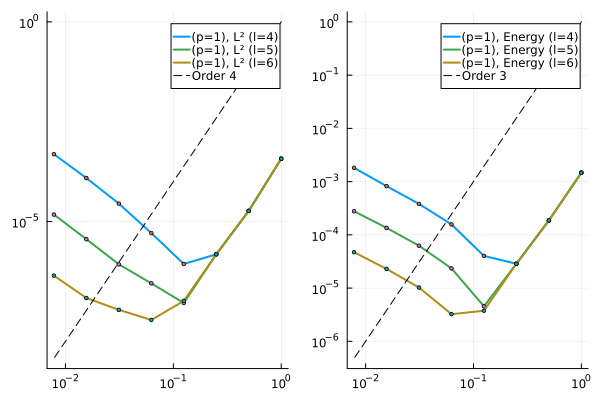

# MultiscaleFEM.jl

## Introduction

This repository contains the source code to implement the Localized Orthogonal Decomposition method and the Higher order Multiscale Method to solve the Poisson problem

$$
\begin{align*}
    -(D_{\varepsilon}(x)u'(x))' = f(x) &\quad x \in \Omega = (0,1),\\
    u(0) = u(1) = 0,
\end{align*}
$$

the heat equation supplemented with initial and boundary conditions 

$$
\begin{align*}
  u_t(x,t) - (D_{\varepsilon}(x)u_x(x,t))_x = f(x,t) &\quad (x,t) \in (0,1) \times (0,\infty),\\
  u(x,0) = u_0(x) &\quad x \in (0,1),\\
  u(0,t) = u(1,t) =0 &\quad t \in (0,\infty),
\end{align*}
$$

and the wave equation

$$
\begin{align*}
  u_{tt}(x,t) - (D_{\varepsilon}(x)u_x(x,t))_x = f(x,t) &\quad (x,t) \in (0,1) \times (0,\infty),\\
  u(x,0) = u_0(x) &\quad x \in (0,1),\\
  u_t(x,0) = u_1(x) &\quad x \in (0,1),\\
  u(0,t) = u(1,t) =0 &\quad t \in (0,\infty),
\end{align*}
$$

Here $D_{\varepsilon}$ is a highly oscillatory coefficient. Traditional methods often need very small meshes to resolve the oscillations on the fine scale and thus we turn to multiscale methods.

## Higher order multiscale method
-------

The implementation is based on the paper by [Maier, R.](https://epubs.siam.org/doi/abs/10.1137/20M1364321). This method is local upto the patch of size $l$ ouside the element. I use the standard finite element method on the patch to compute the projection of the $L^2$ functions on the coarse space. This mesh on the fine scale needs to be sufficiently small to resolve the fine scale effects. Since the problem is solved locally, the fine-scale effects could be captured using reasonably large mesh on the patch. 

The new basis function then contains the fine scale information and can be used to find the numerical solution that contains the information on the fine scale. This needs to be computed once and can be used repeatedly, for example, to solve time dependent problems. For example, the following figure shows the multiscale basis function containing the fine scale information. The diffusion coefficient here is a piecewise constant function on a very fine scale $(\epsilon = 2^{-7})$. 

|  |
| --- |

### Poisson equation in 1D

The script `HigherOrderMS/1d_Poisson_eqn.jl` contains the code to solve the one-dimensional Poisson problem using the Higher Order Multiscale method. I implement three different diffusion coefficients:

$$
D_{\varepsilon}(x) = 0.5, \quad D_{\varepsilon}(x) = \left(2 + \cos{\frac{2\pi x}{2^{-6}}}\right)^{-1}, \quad D_{\varepsilon}(x) = \text{rand}\left(0.5, 5.0;\, \epsilon = 2^{-12} \right).
$$

where $\epsilon = 2^{-12}$ denotes the scale of the randomness, i.e, the diffusion coefficient is constant at an interval of size $\epsilon$. We can observe that the multiscale method captures the exact solution accurately at small scales using relatively small elements `(N=8)` in the coarse space. The fine-scale mesh size was taken to be equal to $h = 2^{-15}$.

| Smooth Diffusion Term | Oscillatory Diffusion Term | Random Diffusion Term |
| --- | --- | --- |
|  |  |  | 


### Heat equation in 1D

The script `HigherOrderMS/1d_heat_eqn.jl` contains the code to solve the transient heat equation in 1D. The spatial part is handled using the finite element method (both traditional and multiscale) and the temporal part is discretized using the fourth order backward difference formula (BDF4). I use $h = 2^{-11}$ on the fine scale and $H=2^{-1}$ on the coarse scale. I set the oscillatory coefficient $D_{\varepsilon}(x)$ equal to

$$
D_{\varepsilon}(x) = \left(2 + \cos{\frac{2\pi x}{2^{-2}}}\right)^{-1}
$$

and the smooth coefficient 

$$
D_{\varepsilon}(x) = D_0 = 0.5
$$

In both cases, the right hand side $f(x,t) = 0$ and the initial condition $u_0(x) = \sin{\pi x}$. In the constant diffusion case, the exact solution can be obtained analytically and is equal to $u(x,t) = \exp{\left(-D_0 \pi^2 t\right)}u_0(x)$. This example can be used to study the convergence of the method. Following figure shows the solution obtained using the multiscale method.  

| Smooth Diffusion Term | Oscillatory Diffusion Term |
| --- | --- |
|  |  |


**The main advantage of the multiscale method is that it provides an increase in computational efficiency.** This is because the linear system (on the coarse space) obtained after computing the multiscale basis is much smaller than the linear system obtained using the traditional method (on the fine space). Comparing the time taken to solve 10000 iterations in the time marching step, we see that the multiscale method takes less time to complete the iterations. 

``` julia
  # nf = 2^11, nc = 2^4, Δt = 1e-4, tf = 1.0
  Direct Method takes:   10.260 s (1559011 allocations: 25.42 GiB)
  Multiscale Method takes:   6.102 s (6621011 allocations: 6.63 GiB)
```

### Wave equation in 1D

The script `HigherOrderMS/1d_wave_eqn.jl` contains the code to solve the acoustic wave equation in 1D. The spatial part is handled using the multiscale finite element method and the temporal part is discretized using Crank Nicolson scheme. I check two different wave speeds

$$
D_{\varepsilon}(x) = 4.0, \quad D_{\varepsilon}(x) = 4.0 + \left( \cos{\frac{2πx}{2^{-2}}} \right)
$$

In both cases, I set the right hand side $f(x,t) = 0$, the initial conditions $u(x,0) = 0$, $u_t(x,0) = 4\pi \sin\left(2\pi x\right)$. For the smooth wave speed case, the exact solution is given by $u(x,t) = \sin\left(2\pi x\right) \sin\left(4\pi t\right)$. We observe that the multiscale method gives a good approximation to the exact solution (smooth wave speed).

| Smooth wave speed | Oscillatory wave speed |
| --- | --- |
|  |  |

### Rate of convergence of the multiscale method
-------

All the rate of convergence examples can be found inside the folder `HigherOrderMS/`. The script `HigherOrderMS/rate_of_convergence_eg1.jl` contains the code to perform convergence analysis for the smooth diffusion case, whereas `HigherOrderMS/rate_of_convergence_eg2.jl` and `HigherOrderMS/rate_of_convergence_eg3.jl` contains the code to solve the problem with oscillatory and random diffusion coefficients, respectively.

#### Smooth Diffusion Coefficients
-------
The following figure shows the rate of convergence of the multiscale method for the lowest order case (`p=1` in the discontinuous space) and varying patch size, $l$. The example was run for a smooth diffusion coefficient. Following is the test example:

$$
 -(A(x)u'(x))' = f(x) \quad in \quad x \in \Omega = (0,1),
$$

with 

$$
  A(x) = 1, \quad f(x) = \pi^2\sin(\pi x)
$$

The corresponding exact solution is $u(x) = \sin(\pi x)$. 

 | 
--- |

We observe optimal convergence rates discussed in Maier, R., 2021 until the mesh size becomes too small. In that case a larger patch size (indicated by the parameter $l$) is required to obtain similar convergence rates for finer mesh. The growing part in the error is controlled by an $exp(-C_{dec} l)$ term and vanishes for higher value of $l$. 

 | 
--- |

This is in line with the observation made in Maier, R., 2021. Similar observations can be made for the higher-order cases as well, `(p=2)` and `(p=3)`. 

`(p=2)` | `(p=3)` |
--- | --- |
 |  |

We can solve the problem upto the coarse-mesh size $H = 2^0, 2^{-1}, \cdots, 2^{-12}$ with the fine scale at $h=2^{-16}$. However, the method does not show convergence for very fine coarse-meshes unless the localization parameter is chosen high enough.

 |
--- |

#### Oscillatory and Random Diffusion Coefficients
-------

Finally we can observe the same behaviour for the other choices of diffusion coefficients. The diffusion coefficients were chose identical to the ones discussed in the previous section. The right hand side data $f(x) = \frac{\pi^2}{2}\sin{\pi x}$ for the oscillatory case and $f(x) = \sin{5\pi x}$ for the random diffusion case.

Oscillatory coefficient | Random coefficients |
--- | --- |
 |  | 

#### Time dependent problems
-------

##### **Heat equation**

I solve the following parabolic initial boundary value problem using the multiscale method `(HigherOrderMS/rate_of_convergence_eg4jl)`.

$$
\begin{align*}
  u_t - (A(x)u_x(x,t))_x = 0 &\quad (x,t) \in (0,1) \times (0,T),\\
  u(x,0) = \sin(\pi x) &\quad x \in (0,1),\\
  u(0,t) = u(1,t) =0 &\quad t \in (0,T),
\end{align*}
$$

I take $h = 2^{-15}$ and $H = 2^0, 2^{-1}, \cdots, 2^{-7}$. In the temporal direction, I set $\Delta t = 10^{-4}$ and solve till final time $T = 1.0$. I use the fourth order backward difference formula for discretizing the temporal part. The exact solution was taken to be the standard finite element solution on a mesh whose size is $h$. I compute the rate of convergence for the smooth diffusion coefficient 

$$
A(x) = 0.5,
$$

and the oscillatory coefficient

$$
A(x) = \left(2 + \cos{\frac{2\pi x}{2^{-6}}}\right)^{-1} .
$$

Constant coefficient | Oscillatory coefficient |
--- | --- |
 | 

Similar behavior can be seen for higher order methods also.

`(p=2)` (Oscillatory coefficient) | `(p=3)` (Oscillatory coefficient) |
--- | --- |
 |  |

**NOTE:** I modified the vector assembly function by simply forcing the function to return zeros.

``` julia
# RHS Function
function fₙ_MS!(cache, tₙ::Float64)
  contrib_cache, Fms = cache
  # vector_cache = vec_contribs!(contrib_cache, y->f(y,tₙ))
  # fcache = local_basis_vecs, elem_indices_to_global_indices, Lᵀ, vector_cache
  # fillsFms!(sFms, fcache, nc, p, l)
  # assemble_MS_vector!(Fms, sFms, ms_elem)
  # Fms
  ####   ####   ####   ####   ####   ####  ####
  #### NOTE: This works only if f(x,t) ≡ 0 ####
  ####   ####   ####   ####   ####   ####  ####
  0*Fms
end
```
This effectively bypasses the assembly routine and will make the code run faster. This works only for the case $f(x,t) = 0$. Please note that the actual assembly step is a major bottleneck in the implementation and needs to optimized further to make the code more efficient (future work).

##### **Wave Equation**

I solve the following wave equation along with the prescribed initial and boundary conditions

$$
\begin{align*}
  u_{tt} - \left(c^2(x)u'(x,t)\right)' = 0 &\quad (x,t) \in (0,1) \times (0,T),\\
  u(x,0) = 0 &\quad x \in (0,1),\\
  u_t(x,0) = \pi \sin(\pi x) &\quad x \in (0,1),\\
  u(0,t) = u(1,t) =0 &\quad t \in (0,T),
\end{align*}
$$

using the multiscale method in space and the Crank-Nicolson method in time. For the temporal discretization, I assume $\Delta t = 10^{-4}$ and solve till final time $T = 1.0\,s$ and $T = 2.0\,s$. For the numerical experiments, I assume that the wave speed $c(x) = 1.0$. The exact solution is assumed to be the numerical solution obtained using the standard finite element method on a fine mesh. Following plots show the rate of convergence of the multiscale method in space for `(p=1)`

`(p=1)` $T=1.0\,s$ | `(p=1)` $T=2.0\,s$ | 
--- | --- |
 |  |

Now, for the higher order case `(p=2,3)`, we observe the following rate of convergence:

`(p=2)` $T=1.0\,s$ | `(p=3)` $T=1.0\,s$ |
--- | --- |
 |  |


## Localized Orthogonal Decomposition Method
-------

The localized orthogonal decomposition method implementation can be found inside the `LOD/` folder. The program `LOD/main.jl` contains the code to check the rate of convergence of the LOD method. The file `LOD/1dFunctions.jl` contains the routines to compute the standard finite element basis along with the functions assemble the global matrices. The file `LOD/1dFunctionsMultiScale` contains the code to compute the multi-scale basis along with the function to compute the $L^2$ error of the multiscale-FEM solution. Running the code `LOD/main.jl`. The multiscale basis corresponding to $(H=0.25)$ and $\varepsilon=2^{-5}$ along with the finite element solution and the rate of convergence for various mesh-size is shown below:


 |  |  | 
--- | --- | --- |

For more details on the method, refer to [Målqvist, A. et al](https://epubs.siam.org/doi/book/10.1137/1.9781611976458).


## References

- Målqvist, A. and Peterseim, D., 2020. Numerical homogenization by localized orthogonal decomposition. Society for Industrial and Applied Mathematics.
- Maier, R., 2021. A high-order approach to elliptic multiscale problems with general unstructured coefficients. SIAM Journal on Numerical Analysis, 59(2), pp.1067-1089.
